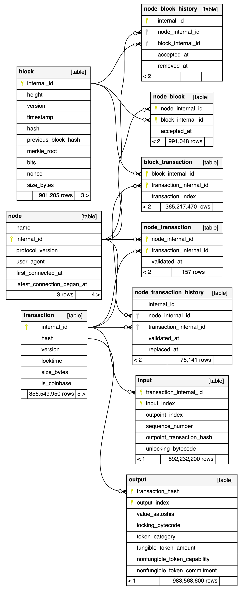

# Chaingraph Schema

This document describes the database schema used by Chaingraph, including the rationale behind various design decisions.

## Overview

Chaingraph stores all chain data in a Postgres SQL database, maintaining consistency between a set of trusted nodes and the Chaingraph database state.

## GraphQL Schema

To review Chaingraph's default GraphQL Schema, see the [**generated schema documentation**](./generated-schema.md), or experiment with the schema at [**`try.chaingraph.cash`**](https://try.chaingraph.cash).

Because the Chaingraph API is served by Hasura, the default GraphQL schema and data model can be extended to include additional tables, columns, indexes, computed fields, and relationships. For definitive schema information, review the GraphQL schema generated by your Chaingraph instance.

## Data Model

The diagram below illustrates the data model used by Chaingraph's Postgres database.

For detailed descriptions of each table, field, default indexes, and Postgres function, review the comments in the [SQL migration files](../images/hasura/hasura-data/migrations/default). Post-sync required indexes can be found in [`indexDefinitions`](../src/components/db-utils.ts).

<!-- Generated using `yarn gen:schemaspy` -->

<p align="center"></p>
<p align="center">Generated Jan. 2023 with <code>yarn gen:schemaspy</code> on a database synced with <code>mainnet</code>, <code>testnet</code>, and <code>chipnet</code>.</p>

## Mutability

The Chaingraph data model reduces the base table sizes by de-duplicating many common fields.

For example, where other indexers might store `fee_satoshis` in each `transaction` row, Chaingraph uses a stored procedure to compute each `fee_satoshis` value when requested. For applications which commonly require this field, the `transaction_fee_satoshis_index` can be created to effectively pre-compute this value for all transactions. This strategy offers the best of both worlds: applications which don't require fast aggregation of this field save `~2.5GB`, while applications which require fast aggregation can still get equivalent performance to an in-table `fee_satoshis` column.

This field de-duplication strategy can significantly reduce database storage requirements, but to achieve good performance, it requires a strict immutability policy across many tables: if – for example – a single `output` record is deleted, the `transaction` record it references will begin to misreport its `fee_satoshis` value, since the `transaction_fee_satoshis` method subtracts the sum of output values from the sum of input values.

For this reason, the database schema includes triggers which serve to prevent various child records from being deleted without also deleting the parent record. These limitations are important for avoiding data corruption: applications which attempt to delete or mutate records should carefully evaluate if those strategies compromise the integrity of the Chaingraph database.

<!-- TODO: additional triggers to prevent corruption via deletions -->

## Approximate Space Usage

The Chaingraph database **requires approximately 300% of raw blockchain size** (approximately the base storage space required by the Satoshi implementation without `txindex`). Up to ~10% of this overhead is due to less storage-efficient integers in Postgres ([`bigint` is the minimum-sized column](../.github/CONTRIBUTING.md#use-of-bigint-for-uint32-in-postgres)), and the remaining overhead is due to required indexes – primary keys and indexes which enable fast lookups by hash, height, locking bytecode, and spent output.

Immediately after the initial sync, Chaingraph attempts to build any missing required indexes – depending on the memory available to Postgres, **index building can require significantly more storage space than is ultimately needed after index creation**. To accommodate, it can be valuable to allocate ~20% of additional storage space for initial indexing (and future expansion), for a total of ~320% of raw blockchain size.

_For example, as of October 2021, archival, mainnet [BCHN](https://bitcoincashnode.org/) full nodes required ~191 GB, while Chaingraph's Postgres database required ~574 GB. Given the 320% target, the recommended Postgres volume size was at least ~611 GB to sync a new Chaingraph deployment._

If index creation fails, Chaingraph will restart and try again – simply [expand the volume](../charts/chaingraph/readme.md#expanding-volumes) provisioned to Postgres, and index creation should complete successfully.

Multi-node, multi-chain deployments share common history, so only divergent blocks require additional block space. Independent transaction validation and block acceptance histories are stored for each node, increasing storage requirements by a negligible amount. (Additional `node_block` records require `16 bytes * block count` bytes per node – about 10 MB on BCH mainnet, and `node_transaction` records require `24 bytes * mempool TX count` per node – about 2.5 MB for 100,000 transactions.)

### BCH Mainnet Space Usage

This section is periodically updated to provide approximate storage usage information for all default tables and indexes. Actual storage usage will be affected by file system compression and Postgres vacuuming progress. (Vacuuming frees wasted space in the database, so storage usage will fall in the hours/days after initial sync as the database reclaims unused space. The Postgres `VACUUM FULL` command locks the table and performs this compression immediately.)

The below table is derived from the [`/space` view in `pgHero`](../.github/CONTRIBUTING.md#using-pghero) on a recently-synced Chaingraph Postgres database with a single, mainnet BCH node.

_**Last Update**: 2023-01-23_

| Relation                      | Size               |
| ----------------------------- | ------------------ |
| input                         | 189 GB             |
| output                        | 108 GB             |
| output_pkey                   | 84.2 GB            |
| spent_by_index                | 56.3 GB            |
| transaction                   | 37.2 GB            |
| input_pkey                    | 33.6 GB            |
| transaction_hash_key          | 26.1 GB            |
| output_search_index           | 20.7 GB            |
| block_transaction             | 17.8 GB            |
| block_transaction_pkey        | 11.5 GB            |
| block_inclusions_index        | 7.64 GB            |
| transaction_pkey              | 7.64 GB            |
| block                         | 168 MB             |
| block_hash_key                | 67.9 MB            |
| node_block                    | 44.2 MB            |
| node_block_pkey               | 32.1 MB            |
| block_internal_id_key         | 19.9 MB            |
| block_pkey                    | 19.9 MB            |
| block_height_index            | 19.1 MB            |
| node                          | 16 KB              |
| node_internal_id_key          | 16 KB              |
| node_name_key                 | 16 KB              |
| node_pkey                     | 16 KB              |
| node_transaction              | varies<sup>1</sup> |
| node_transaction_pkey         | varies<sup>1</sup> |
| node_transaction_history      | varies<sup>2</sup> |
| node_transaction_history_pkey | varies<sup>2</sup> |
| node_block_history            | varies<sup>3</sup> |
| node_block_history_pkey       | varies<sup>3</sup> |

- Average Transactions Per Day (Jan 2023): **~12,000 transactions/day**
- Average Transaction Size (Jan 2023): **838 bytes**
- Average Transaction Throughput Per Day (Jan 2023): **~10 MB**

<details><summary>SQL</summary>

```sql
SELECT (COUNT(*) / DATE_PART('doy', now())) AS avg_tx_per_day
  FROM block_transaction WHERE block_transaction.block_internal_id IN
    (SELECT block.internal_id FROM block
      WHERE block.timestamp >
        extract(epoch from TO_TIMESTAMP(DATE_PART('year', now())::text, 'YYYY')::timestamp AT time zone 'UTC'));
```

```sql
SELECT
  AVG(transaction.size_bytes) AS avg_tx_bytes,
  (SUM(transaction.size_bytes) / DATE_PART('doy', now())) AS avg_tx_bytes_per_day
  FROM transaction
    JOIN block_transaction ON transaction.internal_id = block_transaction.transaction_internal_id
  WHERE block_transaction.block_internal_id IN
    (SELECT block.internal_id FROM block
      WHERE block.timestamp >
        extract(epoch from TO_TIMESTAMP(DATE_PART('year', now())::text, 'YYYY')::timestamp AT time zone 'UTC'));
```

</details>

1. The `node_transaction` table represents the current mempool of each node, and rows are moved to `node_transaction_history` upon transaction confirmation. It will typically hold between zero and a few MBs.
2. The `node_transaction_history` table grows at a rate of 32-40 bytes per node per transaction in which Chaingraph was online when the transaction was heard on the network (saving a `validated_at` timestamp and occasionally a `replaced_at` timestamp). **At the 2021 average throughput of ~168,000 daily transactions, this adds approximately 6 MB per day that Chaingraph has been running**. `node_transaction_history_pkey` is a unique index on a `bigint` field adding approx. 25% of the size of `node_transaction_history`.
3. `node_block_history` is exceptionally rare. Unless you're operating Chaingraph on a test network with regular block chain re-organizations, this table (and the `node_block_history_pkey` index) will require no meaningful storage space.
